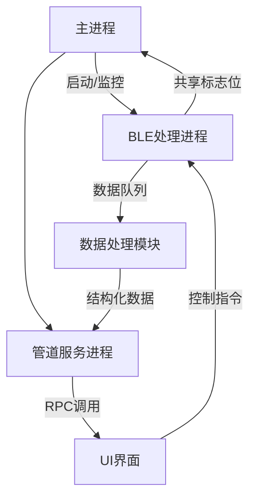
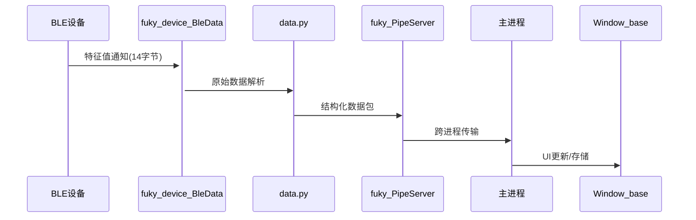

# FUKY_Project 内部开发日志 2025 5 2

## 功能说明

### 核心模块
1. **Window_base.py**:  
   - 功能：主程序
   - 描述：
     - 提供主窗口基类
     - 双目定位线程暂时合并到该主程序的进程下，可能会导致性能问题
     - 负责启动并管理其他工作进程
### 蓝牙通信层
2. **fuky_device_BleData.py**:  
   - 功能：BLE的fuky鼠标的处理进程
   - 描述：
     - 实现设备发现、连接、特征值订阅全流程
     - 支持IMU数据解析（加速度计+四元数）
     - 提供共享内存标志位(device_found_flag)和进程间队列(data_queue)用于进程间通信，后续可能会切换为共享内存
     - 包含Windows蓝牙GATT服务操作封装

### 数据处理层
3. **data.py**:  
   - 功能：传感器数据解析与转换
   - 描述：
     - 实现14字节原始数据包解析（6字节加速度+8字节四元数）
     - 提供Q14/Q8定点数转换浮点算法
     - 支持数据结构化存储与共享内存管理
     - 包含错误处理和数据校验机制

### 应用数据输出
4. **fuky_PipeServer.py**:  
   - 功能：跨语言进程间命名通信管道服务
   - 描述：
     - 为未来在blender/Unity上的应用提供数据输出，因为输出的都是少量高频的数据，暂时用命名管道就可以
     - 仅支持单客户端连接
     - 提供数据序列化/反序列化功能

### 测试验证用的临时部分
5. **test_ble_process.py**:  
   - 功能：蓝牙子系统测试框架
   - 描述：
     - 验证设备发现流程
     - 测试数据接收稳定性
     - 性能压力测试工具
     - 包含30秒自动化测试用例

6. **data.py**:  
   -  临时搞的一个文件，用来存一些后面可能会用上的函数

### 项目管理
7. **FUKY_Update_LOG.md**:  
   - 功能：项目全生命周期文档
   - 描述：
     - 记录架构变更和功能演进
     - 维护模块依赖关系说明
     - 跟踪技术决策记录

---

## 系统架构说明

### 架构分层
1. **设备交互层**:
   - 蓝牙协议栈对接（WinRT API）
   - 设备发现与连接管理
   - 原始数据采集

2. **数据处理层**:
   - 传感器数据解析/校验
   - 坐标转换与滤波处理
   - 数据结构标准化

3. **应用服务层**:
   - 进程间通信服务
   - 任务调度与管理
   - 异常处理与恢复

4. **用户界面层**:
   - 数据可视化
   - 设备状态监控
   - 交互控制

### 进程架构

### 数据流

### 关键机制
1. **异步处理**:
   - 基于asyncio的事件循环
   - 非阻塞式设备扫描
   - 协程级并发控制

2. **进程间通信**:
   - 共享内存标志位(Value)
   - 多生产者-消费者队列(Queue)
   - 管道服务器(PipeServer)

3. **异常容错**:
   - 蓝牙连接重试机制
   - 数据校验重传
   - 看门狗进程监控

4. **扩展能力**:
   - 模块化设备驱动
   - 可配置解析规则
   - 插件式数据处理
