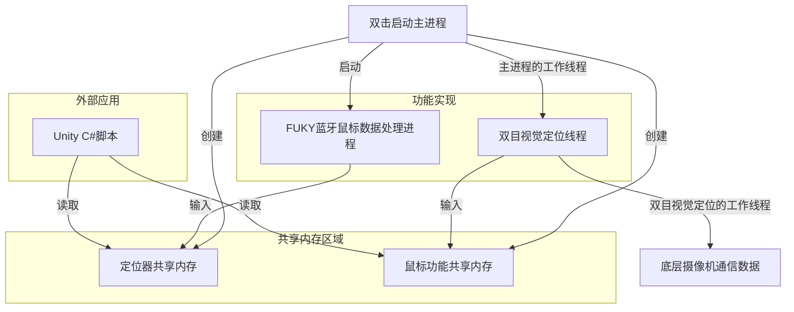
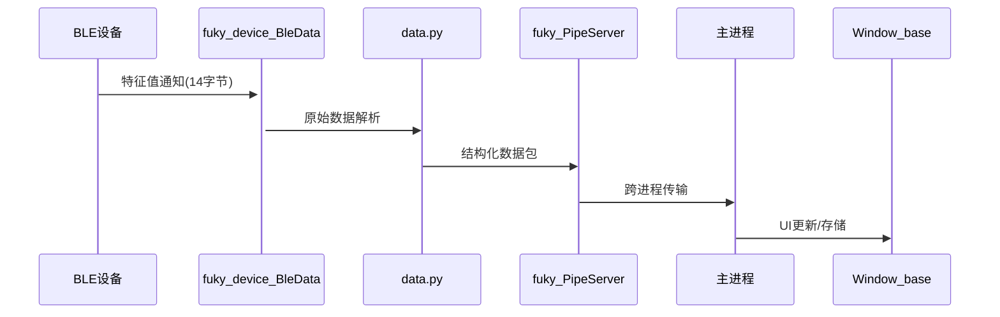

# FUKY_Project 开发日志

2025年5月3日 ▼

## 2025年5月3日
### 今天目标
- [ ] 1.给电路板插一盏红外led
- [x] 2.去掉原来的命名管道机制，新建一个支进程用来管理共享内存
- [x] 3.给unity的插件写一个底层的RawDataReading脚本，作为插件的基础
- [ ] 4.改良ble连接检测，添加发现设备断开和重连的机制
#### **已完成目标及完成方式**:
- 2.现在主进程直接在启动时会创建两个共享内存，一个处理鼠标的IMU和压感，一个处理定位器的坐标数据
- 3.Unity已经收到IMU的RawData，四元数旋转已经可用，平均0.05s收到一次，但是还没有把定位器的数据用这种方式传过去
#### **未完成目标及问题**:
- 1.红外led —— 接线端子买大了，就差0.25mm
- 4.改良Ble连接检测 —— 比预想的要复杂
### 下一步工作目标
- 让Unity也能够用共享内存的方式读取定位器计算得出的坐标
- 以跑通流程为主要目标，开始测试现在的屎山软件驱动在同时处理视觉和蓝牙设备时的表现
- 
### 挂起的需求(由新到旧排列)
- 根据鼠标状态来发送相应数据，或者给鼠标程序搞俩进程，分配给两个CPU Core去跑，节省带宽看能不能提升下光电的回报率
- 敏捷拉的屎山积压的问题要爆发了，各种进程线程架构组织混乱，在同时处理双目定位和IMU的数据时会出现各种问题
- 图像帧的并行处理，降低延迟
- 脉冲同步
- 根据imu和光电一起判断鼠标的状态，是抬起还是放下
- 进程间通信问题，让窗口UI主进程能读取到imu的数据
- 现在定位器的临时结构设计有问题，如果频繁挪动会导致摄像头断触和结构疲劳

2025年5月2日 ▼

   
## 2025年5月2日
### 已解决
**1【鼠标自定义数据传输问题】:**
- 用window的api来解决ble的读取，确保读取特征值的同时不会影响正常鼠标功能
- 将读取的程序封装成一个类
- 新建一个进程来运行这个ble读取程序，放到主进程中维护

### 下一步工作目标
【驱动内容】
- 问题：命名管道类似服务器的方式传输数据维护麻烦、需要频繁处理断开和连接的状态
- 问题：ble设备如果在驱动运行之前还没有连接上电脑的话，就会出bug，
- 问题：需要尽快提供Unity的接口
- 
### 低优先级需求
- 1图像帧的并行处理，降低延迟
- 2脉冲同步
- 3根据imu和光电一起判断鼠标的状态，是抬起还是放下
- 4进程间通信问题，让窗口UI主进程能读取到imu的数据
- 5现在定位器的临时结构设计有问题，如果频繁挪动会导致摄像头断触和结构疲劳

2025年5月1日 ▼

## 2025年5月1日
### 已解决
**【光斑检测稳定性问题】:**
- 解决方式-当区域没有检测到明显光斑时，记录一帧图像，当检测到光斑后，就用之前记录的图像进行相减操作，从而滤除背景
- 附加优化-简化了光斑检测的方式，去掉了求平均的做法，解决了重影导致的光斑质心坐标闪烁的问题
- 隐患-如果背景有大块的自然光或人造灯源直射，会导致疯狂闪烁或无法检测出正确的光源

2【鼠标功能】
- 光电已经正确配置
- imu也已经正确配置
- 工程用回到了原来旧的esp-idf框架
### 下一步工作目标
【驱动内容】
- 问题：无法同时实现鼠标功能和imu自定义数据的传输

### 低优先级需求
- 1图像帧的并行处理，降低延迟
- 2脉冲同步
- 3根据imu和光电一起判断鼠标的状态，是抬起还是放下

### 线程/进程架构

### 数据流(不可信)

